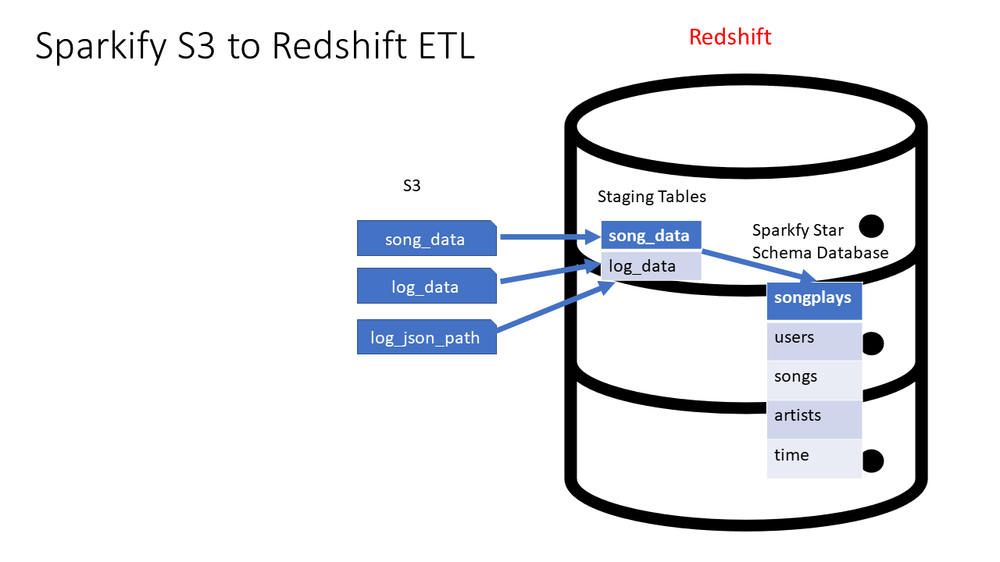
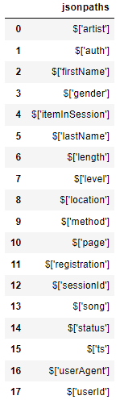
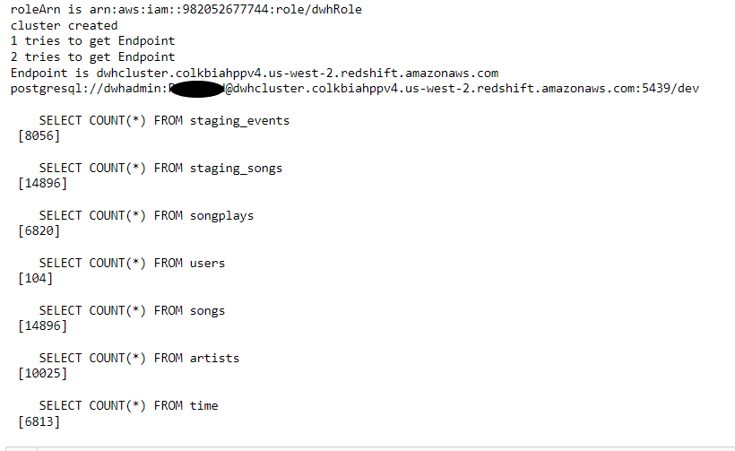

# Cloud Data Warehouses On AWS
A lesson of Udacity's Data Engineering Nanodegree With AWS program.

This repository contains the code for the project of the lesson "Cloud Data Warehouses On AWS" of Udacity's Data Engineering Nanodegree With AWS program. Besides the project for the lesson itself, it also contains the code performed during the exercises of the lesson.

The following are the instruction by Udacity for the project:

## Project: Data Warehouse

### Introduction

A music streaming startup, Sparkify, has grown their user base and song database and want to move their processes and data onto the cloud. Their data resides in S3, in a directory of JSON logs on user activity on the app, as well as a directory with JSON metadata on the songs in their app.



As their data engineer, you are tasked with building an ETL pipeline that extracts their data from S3, stages them in Redshift, and transforms data into a set of dimensional tables for their analytics team to continue finding insights into what songs their users are listening to.

### Project Description
In this project, you'll apply what you've learned on data warehouses and AWS to build an ETL pipeline for a database hosted on Redshift. To complete the project, you will need to load data from S3 to staging tables on Redshift and execute SQL statements that create the analytics tables from these staging tables.

### Helpful Hints
- Many of the issues that you may have will come from security. You may not have the right keys, roles, region, etc. defined and as a result you will be denied access. If you are having troubles go back to the various lessons where you set up a Redshift cluster, or implemented a role, created a virtual network, etc. Make sure you can accomplish those tasks there, then they should be easy for you to recreate in this project. You are likely to have fewer issues with security if you implement the role creation, setup of the Redshift cluster, and destruction of it via Infrastructure As Code (IAC).
- Udacity provides a temporary AWS account for you to build the necessary resources for this project. NB This will REPLACE your AWS credentials which are in your .aws folder. PLEASE make sure you copy those first since they will be overwritten. IF you are having difficulty completing the Project in 1 session (there is a time limit), you MAY find it more effective to use your own AWS account. This would avoid the need to validate your session each time you restart on the project. However, that would be your own funds. It is unlikely that would cost you more than a few dollars.
- The starter code that we give you provides a framework for doing this project. The vast majority of your work will be getting the SQL queries part correct. Very few changes will be required to the starter code.
- This is an excellent template that you can take into the work place and use for future ETL jobs that you would do as a Data Engineer. It is well architected (e.g. staging tables for data independence from the logs and the final Sparkify DWH) AND bulk data loads into the Sparkify DWH for high compute performance via SQL from those staging tables.

### Project Datasets

You'll be working with 3 datasets that reside in S3. Here are the S3 links for each:

- Song data: `s3://udacity-dend/song_data`
- Log data: `s3://udacity-dend/log_data`
- This third file `s3://udacity-dend/log_json_path.json` contains the meta information that is required by AWS to correctly load `s3://udacity-dend/log_data`

#### Song Dataset

The first dataset is a subset of real data from the [Million Song Dataset](http://millionsongdataset.com). Each file is in JSON format and contains metadata about a song and the artist of that song. The files are partitioned by the first three letters of each song's track ID. For example, here are file paths to two files in this dataset.

And below is a screenshot of what a song file `TRAABJL12903CDCF1A.json` looks like:
```
{
    "num_songs": 1, 
    "artist_id": "ARJIE2Y1187B994AB7", 
    "artist_latitude": null, 
    "artist_longitude": null, 
    "artist_location": "", 
    "artist_name": "Line Renaud", 
    "song_id": "SOUPIRU12A6D4FA1E1", 
    "title": "Der Kleine Dompfaff", 
    "duration": 152.92036, 
    "year": 0
}
```

#### Log Dataset

The second dataset consists of log files in JSON format generated by this [event simulator](https://github.com/Interana/eventsim) based on the songs in the dataset above. These simulate app activity logs from an imaginary music streaming app based on configuration settings.

The log files in the dataset you'll be working with are partitioned by year and month. For example, here are file paths to two files in this dataset.

```
log_data/2018/11/2018-11-12-events.json
log_data/2018/11/2018-11-13-events.json
```

And below is an example of what the data in a log file, 2018-11-12-events.json, looks like:


#### Log Json Meta Information

And below is what data is in `log_json_path.json`



### Project Instructions

#### Schema for Song Play Analysis

Using the song and event datasets, you'll need to create a star schema optimized for queries on song play analysis. This includes the following tables.

##### Fact Table

1. **songplays** - records in log data associated with song plays i.e. records with page `NextSong`
    - *songplay_id, start_time, user_id, level, song_id, artist_id, session_id, location, user_agent*

##### Dimension Tables

1. **users** - users in the app *user_id, first_name, last_name, gender, level*
2. **songs** - songs in music database *song_id, title, artist_id, year, duration*
3. **artists** - artists in music database *artist_id, name, location, lattitude, longitude*
4. **time** - timestamps of records in songplays broken down into specific units *start_time, hour, day, week, month, year, weekday*

#### Project Template

To get started with the project, go to the workspace on the next page, where you'll find the project template files. You can work on your project and submit your work through this workspace.

Alternatively, you can download the project template files from the Resources tab above and work on the project on your local computer. You can then upload your files to your workspace for submission.

The project template includes four files:

- `create_tables.py` is where you'll create your fact and dimension tables for the star schema in Redshift.
- `etl.py` is where you'll load data from S3 into staging tables on Redshift and then process that data into your analytics tables on Redshift.
- `sql_queries.py` is where you'll define your SQL statements, which will be imported into the two other files above.
- `README.md` is where you'll provide discussion on your process and decisions for this ETL pipeline.

#### Project Steps

Below are steps you can follow to complete each component of this project.

##### Create Table Schemas

1. Design schemas for your fact and dimension tables
2. Write a SQL CREATE statement for each of these tables in `sql_queries.py`
3. Complete the logic in `create_tables.py` to connect to the database and create these tables
4. Write SQL `DROP` statements to drop tables in the beginning of  `create_tables.py` if the tables already exist. This way, you can run `create_tables.py` whenever you want to reset your database and test your ETL pipeline.
5. Launch a redshift cluster and create an IAM role that has read access to S3.
6. Add redshift database and IAM role info to `dwh.cfg`.
7. Test by running `create_tables.py` and checking the table schemas in your redshift database. You can use Query Editor in the AWS Redshift console for this.

##### Build ETL Pipeline
1. Implement the logic in etl.py to load data from S3 to staging tables on Redshift.
2. Implement the logic in etl.py to load data from staging tables to analytics tables on Redshift.
3. Test by running etl.py after running create_tables.py and running the analytic queries on your Redshift database to compare your results with the expected results.
4. Delete your redshift cluster when finished.

##### Document Process
Do the following steps in your `README.md` file. Here's a [guide](https://www.markdownguide.org/basic-syntax/) on Markdown Syntax.

1. Discuss the purpose of this database in context of the startup, Sparkify, and their analytical goals.
2. State and justify your database schema design and ETL pipeline.
3. [Optional] Provide example queries and results for song play analysis. We do not provide you any of these. You, as part of the Data Engineering team were tasked to build this ETL. Thorough study has gone into the star schema, tables, and columns required. The ETL will be effective and provide the data and in the format required. However, as an exercise, it seems almost silly to NOT show SOME examples of potential queries that could be ran by the users. PLEASE use your imagination here. For example, what is the most played song? When is the highest usage time of day by hour for songs? It would not take much to imagine what types of questions that corporate users of the system would find interesting. Including those queries and the answers makes your project far more compelling when using it as an example of your work to people / companies that would be interested. You could simply have a section of sql_queries.py that is executed after the load is done that prints a question and then the answer.


**Example Output From An ETL Run**



##### Note

The `SERIAL` command in Postgres is not supported in Redshift. The equivalent in redshift is `IDENTITY(0,1)`, which you can read more on in the [Redshift Create Table Docs](https://docs.aws.amazon.com/redshift/latest/dg/r_CREATE_TABLE_NEW.html).

##### Project Rubric 

Read the project rubric before and during development of your project to ensure you meet all specifications.

**Table Creation**

| Criteria | Meets Specifications |
| --- | --- |
| Table creation script runs without errors. | The script, create_tables.py, runs in the terminal without errors. The script successfully connects to the Sparkify database, drops any tables if they exist, and creates the tables. |
| Staging tables are properly defined. | CREATE statements in sql_queries.py specify all columns for both the songs and logs staging tables with the right data types and conditions. |
| Fact and dimensional tables for a star schema are properly defined. | CREATE statements in sql_queries.py specify all columns for each of the five tables with the right data types and conditions. |

**ETL**

| Criteria | Meets Specifications |
| --- | --- |
| ETL script runs without errors. | The script, `etl.py`, runs in the terminal without errors. The script connects to the Sparkify redshift database, loads `log_data` and `song_data` into staging tables, and transforms them into the five tables. |
| ETL script properly processes transformations in Python. | INSERT statements are correctly written for each table and handles duplicate records where appropriate. Both staging tables are used to insert data into the songplays table. |

**Code Quality**

| Criteria | Meets Specifications |
| --- | --- |
| The project shows proper use of documentation. | The README file includes a summary of the project, how to run the Python scripts, and an explanation of the files in the repository. Comments are used effectively and each function has a docstring. |
| The project code is clean and modular. | Scripts have an intuitive, easy-to-follow structure with code separated into logical functions. Naming for variables and functions follows the PEP8 style guidelines. |

**Suggestions to Make Your Project Stand Out!**
- Add data quality checks
- Create a dashboard for analytic queries on your new database