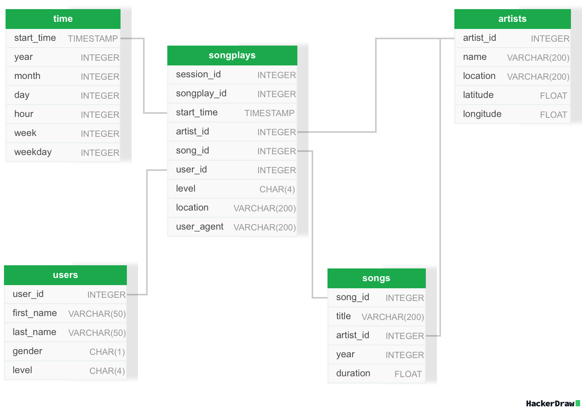

# Udacity's Data Engineering With AWS Nano-Degree - Project: Data Warehouse

This is a **fictional project for lesson 2** of the **Udacity's Data Engineering with AWS nano-degree course** to be review by Udacity. Please find detailled instructions for the project in the file [`sparkify_Instructions_from_Udacity.md`](./sparkify_Instructions_from_Udacity.md).

**Table of Contents**
1. [The (Fictional) Task In A Nutshell](#1-the-fictional-task-in-a-nutshell)
2. [Structure of this Repository](#2-structure-of-this-repository)
3. [Usage](#3-usage)
4. [Data, Model and ETL](#4-data-model-and-etl)
    1. [Data](#41-data)
        1. [Log Data](#411-log-data)
        2. [Song Data](#412-song-data)
    2. [Model](#42-model)
    3. [ETL](#43-etl)
5. [Recommendations for the team](#5-recommendations-for-the-team)

## 1. The (Fictional) Task In A Nutshell

A music streaming startup named Sparkify has grown their user base and song database and want to move their processes and data onto the cloud of AWS. Sparkify`s data already resides in S3-buckets, 
- in a directory of JSON logs on user activity on the app, as well as 
- in a directory with JSON metadata on the songs.
- For the JSON logs, there's also a corresponding JSON `log-json-path.json` file helping to parse the logs.

In order to enable Sparkify to analyze the data, I've been asked to build a data warehouse in AWS Redshift. So, my task to create the infrastructure needed and to build an ETL pipeline that extracts the data from S3, stages them in Redshift, and transforms data into a set of dimensional tables for my colleagues from the analytics team to continue finding insights into what songs our users are listening to.

## 2. Structure of this Repository

Besides this `README.md` the following scripts are relevant for the project:
- `sql_queries.py`
- `create_tables.py`
- `etl.py`

Additionally, I've build a script using the `boto3` library to create the AWS resources needed for the project:
- `infra.py`

Futhermore, [`sparkify_exploration.ipynb`](./sparkify_exploration.ipynb) contains an extensive exploration of the data done locally with data downloaded from the S3-buckets before building the ETL pipeline.

There's also a `dwh.cfg` file which contains the configuration for the AWS resources. Of course, this does not contain AWS credentials needed to build the infrastructure. These are stored in a `.env` file which is not part of this repository.

Please note that, in addition to the project itself, this repository also contains notebooks regarding the relevant exercises in the lesson which are not relevant for the project.

## 3. Usage

## 4. Data, Model and ETL

### 4.1 Data

#### 4.1.1 Log Data
A typical JSON log file looks like this:
```
{
    'artist': 'Sound 5',
    'auth': 'Logged In',
    'firstName': 'Jacob',
    'gender': 'M',
    'itemInSession': 2,
    'lastName': 'Klein',
    'length': 451.21261,
    'level': 'paid',
    'location': 'Tampa-St. Petersburg-Clearwater, FL',
    'method': 'PUT',
    'page': 'NextSong',
    'registration': 1540558108796.0,
    'sessionId': 518,
    'song': 'Latin Static',
    'status': 200,
    'ts': 1542462343796,
    'userAgent': '"Mozilla/5.0 (Macintosh; Intel Mac OS X 10_9_4) AppleWebKit/537.78.2 (KHTML, like Gecko) Version/7.0.6 Safari/537.78.2"',
    'userId': '73'
}
```
As we are aiming to build a data warehouse for querying song plays, it is important to notice that not all log entries are relevant for the data warehouse. Files where `auth` is not `Logged In` or where `lenght` is 0 are those not containing the relevant information. So, we need to filter out those files before loading them into the final files.  
We are also provided with a JSON file `log_json_path.json` which contains the path to the relevant information in the log files. This is used to parse the log files.
The schema for saving the `log_data` files in Redshift is:
| Column Name    | Data Type      | Availability |
|----------------|----------------|--------------|
| artist         | VARCHAR(200)   | NULL         |
| auth           | VARCHAR(50)    | NOT NULL     |
| firstName      | VARCHAR(50)    | NULL         |
| gender         | CHAR(1)        | NULL         |
| itemInSession  | INTEGER        | NOT NULL     |
| lastName       | VARCHAR(50)    | NULL         |
| length         | FLOAT          | NULL         |
| level          | CHAR(4)        | NOT NULL     |        
| location       | VARCHAR(200)   | NULL         |
| method         | VARCHAR(10)    | NOT NULL     |
| page           | VARCHAR(50)    | NOT NULL     |
| registration   | FLOAT          | NULL         |
| sessionId      | INTEGER        | NOT NULL     |
| song           | VARCHAR(200)   | NULL         |
| status         | INTEGER        | NOT NULL     |
| ts             | BIGINT         | NOT NULL     |
| userAgent      | VARCHAR(200)   | NULL         |
| userId         | INTEGER        | NULL         |

To include a data quality check, we require `sessionId` and `itemInSession` to be unique.

#### 4.1.2 Song Data
A typical JSON song file looks like this:
```
{
    'artist_id': 'ARLYGIM1187FB4376E',
    'artist_latitude': None,
    'artist_location': '',
    'artist_longitude': None,
    'artist_name': 'Joe Higgs',
    'duration': 162.82077,
    'num_songs': 1,
    'song_id': 'SOQOOPI12A8C13B040',
    'title': 'Wake up And Live',
    'year': 1975
}
```
It is important to notice here, that the `song_data` files are not matching well with the `log_data` files. This may be due to different sources or naming convention, misspellings, etc. So, we need to be careful when joining the data and concentrate on data from the `log_data` files.

The schema for saving the `song_data` files in Redshift is:
| Column Name      | Data Type      | Availability |
|------------------|----------------|--------------|
| artist_id        | VARCHAR(50)    | NOT NULL     |
| artist_latitude  | FLOAT          | NULL         |
| artist_location  | VARCHAR(200)   | NULL         |
| artist_longitude | FLOAT          | NULL         |
| artist_name      | VARCHAR(200)   | NOT NULL     |
| duration         | FLOAT          | NOT NULL     |
| num_songs        | INTEGER        | NOT NULL     |
| song_id          | VARCHAR(50)    | NOT NULL     |
| title            | VARCHAR(200)   | NOT NULL     |
| year             | INTEGER        | NOT NULL     |

Please note that `year` is sometimes 0, which is not a valid year. So, we need to convert these values to `NULL` before loading them into the final files.


### 4.2 Model

The database schema is a star schema with one fact table and four dimension tables.  
The **fact table** is 
- `songplays`  

and the **dimension tables** are 
- `users`, 
- `songs`, 
- `artists`, and 
- `time`:



Please note the following:
- The `songplays` table 
    - has a composite unique primary key consisting of `session_id` and `songplay_id`, the latter is build on `itemInSession`,
    - has a foreign key to the `time` table (`start_time`), the `users` table (`user_id`), the `songs` table (`song_id`), and the `artists` table (`artist_id`),
    - is evenly distributed across the nodes of the cluster, as the later queries are not clear yet, and
    - is sorted by `start_time`.
    - All columns are not nullable.
- The `time` table
    - has a unique primary key (`start_time`),
    - is evenly distributed across the nodes (using the `DISTSTYLE EVEN` strategy) assuming times when songs are played is growing over time, and would sooner or later not fit on a single node, and
    - is sorted by `start_time` to enable faster joins with the `songplays` table.
    - All columns are not nullable.
- The `users` table
    - has a unique primary key (`user_id`),
    - is available on all nodes of the cluster (using the `DISTSTYLE ALL` strategy) assuming that the number of users is small enough to fit on all nodes, and to enable fast joins with the `songplays` table, and
    - is sorted by `last_name`, `first_name`, `gender`, and `level`.
    - All columns are not nullable.
    - The `level` column here, represents the lastest known subscription level of the user. This is different than in the songplays table, where the `level` column represents the subscription level at the time of the song play. 
- The `artists` table
    - has a unique primary key (`artist_id`),
    - is available on all nodes of the cluster (using the `DISTSTYLE ALL` strategy) assuming that the number of artists is small enough to fit on all nodes, and to enable fast joins with the `songplays` table, and
    - is sorted by `name`.
    - The columns `location`, `latitude`, and `longitude` are nullable. They are gathered from the song files, which are not always complete, and are only partly matching the artist information from the log files.
- The `songs` table
    - has a unique primary key (`song_id`),
    - is available on all nodes of the cluster (using the `DISTSTYLE ALL` strategy) assuming that the number of songs is small enough to fit on all nodes, and to enable fast joins with the `songplays` table, and
    - is sorted by `title`, `artist_id`, and `year`.
    - It is also linked to the `artists` table using the `artist_id` column, which is a deviation from the original star schema principle, but helps combining these specific data.
    - The columns `duration` and `year` are nullable. They are gathered from the song files, which are not always complete, and are only partly matching the song information from the log files.
- Don't confuse the `artist_id` and the `song_id` from the `song_data` files with the `artist_id` and the `song_id` in this schema. The `song_data` files are not matching well the entries in the `log_data` files regarding names and titles. Therefore, own keys are used for the `songs` and `artists` tables, and as a consequence, for the `songplays` table as well.

### 4.3 ETL

## 5. Recommendations for the team
- The data in the `log_data` files regarding artist names and song titles does not match the data from the `song_data` files. Also the `song_data` files seem to have some issues that look like duplicates and wrong entries. To build a good data source for analytics, the corresponding processes should be reviewed and improved.
- The usage in terms of common queries and the future size of the different tables is not clear yet. Therefore, the distribution strategy for the tables is not optimized yet. This should be reviewed once the usage and the size of the data is clearer.
- Right now, using a Redshift cluster is not really necessary. The data is small enough to be processed on a single node or even a more traditional SQL database. However, if the data is growing, and the cluster can be easily scaled up. Therefore, it is recommended to use a Redshift cluster from the beginning, but this should be reviewed once the future growth of Sparkify is clearer.


